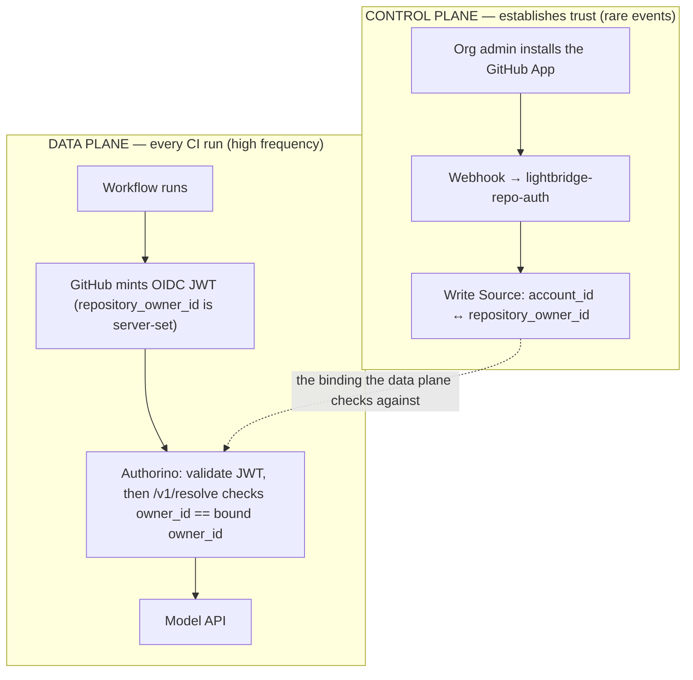
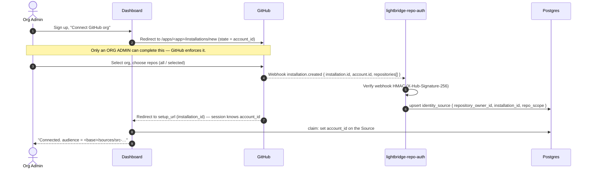
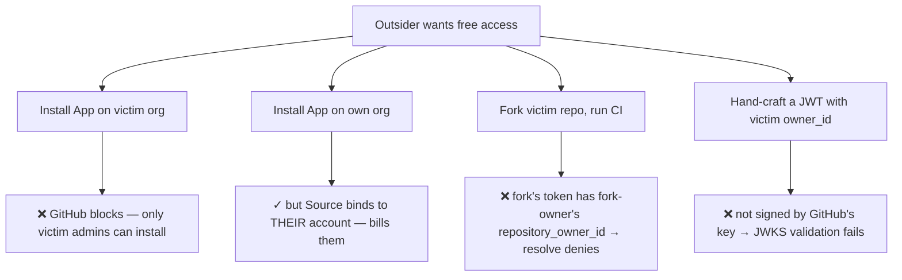
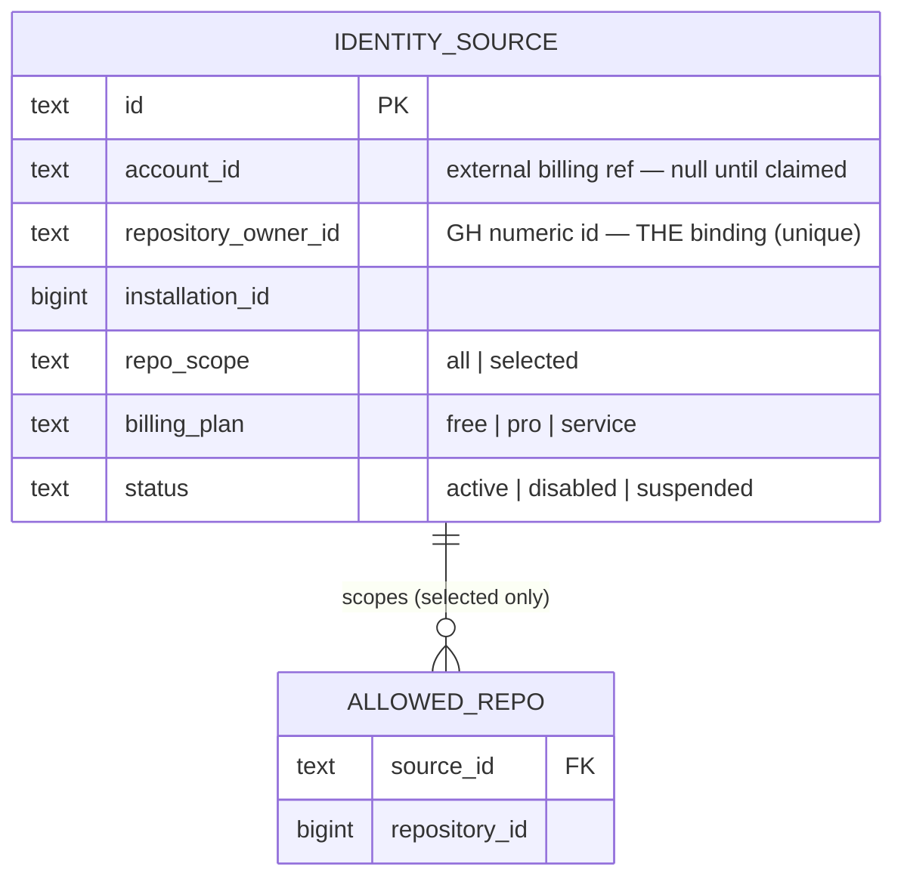

# Auth model: GitHub OIDC → AI gateway

How a CI runner gets AI access with nothing but a standard GitHub Actions OIDC
token, and why a non-paying party can never reach a paying account's quota.

> **The App is the control plane. The OIDC token is the data plane.** The App
> never touches a runtime request; the OIDC token never proves org ownership.
> Each does the half the other can't.

## 1. Two planes



A runtime OIDC token carries `repository_owner_id`, which GitHub guarantees. The
App installation is what tells us *which* `repository_owner_id` belongs to *which*
paying account. Neither alone is enough; together they're airtight.

## 2. Where this design differs from the original sketch

The original write-up put JWT validation + the binding check in **Keycloak** (via
a custom SPI or token-exchange). We changed two things:

1. **Enforcement lives in Authorino, not Keycloak.** Keycloak 26.6's native
   `jwt-bearer` grant (RFC 7523) requires the token `sub` to link to a
   *pre-existing Keycloak user*. CI identities are emergent (`sub =
   repo:org/repo:ref:...`) and must never be pre-registered — the whole point of
   §8. Authorino has no such requirement: it validates the GitHub JWT against
   GitHub's JWKS and calls this service for the dynamic binding. We already run
   Authorino (ai-helm ADR-0021). No SPI, no user provisioning.
2. **The runner sends the raw GitHub OIDC token** as its bearer to the gateway —
   there is no token-exchange hop and no minting backend. This service only
   answers "is this owner bound to an account?".

See ai-helm **ADR-0047** for the gateway-side configuration.

## 3. Onboarding — the App installation establishes the binding



**Trust is captured at the webhook** — `account.id` (→ `repository_owner_id`)
comes from GitHub's payload, never a form. The customer reaches the install only
by being a real admin. The dashboard *claims* the Source (links `account_id`)
during the post-install redirect, where the logged-in session identifies the
account. An unclaimed Source never resolves to `allowed`.

## 4. Runtime — every CI run

```mermaid
sequenceDiagram
    autonumber
    participant WF as Workflow
    participant GHOIDC as token.actions.githubusercontent.com
    participant Plugin as opencode-oauth2 plugin
    participant GW as Envoy AI Gateway
    participant AZ as Authorino
    participant RA as lightbridge-repo-auth /v1/resolve
    participant M as Model API
    Note over WF: permissions: { id-token: write }
    WF->>GHOIDC: request OIDC token (audience = <base>/sources/src-…)
    GHOIDC-->>WF: JWT { repository_owner_id, repository_id, repository, sub, aud }
    Plugin->>GW: request + Bearer <raw GitHub OIDC JWT>
    GW->>AZ: ext-authz
    AZ->>AZ: 1. validate JWT vs GitHub JWKS (iss, exp, sig)
    AZ->>RA: 2. POST { audience, repository_owner_id, repository_id } (+ X-Internal-Token)
    RA->>RA: 3. owner bound? active? claimed? repo in scope? audience matches?
    RA-->>AZ: { allowed:true, account_id, billing_plan }
    AZ->>AZ: 4. authorize on allowed==true; stamp x-account-id / x-billing-plan
    AZ-->>GW: 200
    GW->>M: proxy (rate-limit + budget keyed on x-account-id, ADR-0021/0035)
    M-->>WF: completion
```

Two enforcement points, on purpose:
- **Authorino + this service (steps 1–3): identity** — is this token from a bound,
  claimed, active org? Fast fail before any spend.
- **Gateway rate-limit / budget (step 4 onward): entitlement** — quota & tier, the
  existing ADR-0021/0035 machinery, keyed on the stamped `x-account-id`.

## 5. Why an outsider fails — every attack path



There is no path where a non-paying party reaches a paying account's quota.

## 6. Known properties / limitations (read before relying on this)

- **`owner_id` authorizes the whole org.** Once bound, any repo / branch / workflow
  under that org can spend the account's quota. `selected` scope narrows to a repo
  set, but within an allowed repo any branch qualifies. For tighter control, the
  token also carries `repository`, `ref`, `environment` — gate on a protected
  Environment if needed. (Intra-org abuse is out of scope for v1.)
- **Custom `audience` is mandatory.** If a workflow omits
  `audience: <base>/sources/src-…`, the token gets GitHub's default `aud` → the
  Source lookup fails → denied (fail-closed, but a common onboarding mistake — the
  dashboard should hand customers the exact snippet).
- **Quota is soft under concurrency.** Entitlement caching means parallel runners
  can briefly overshoot. Fine for a fair-use cap; tighten if quotas are hard.
- **GHES / custom issuer** would change `iss` — multi-issuer support is future work.
- The `/v1/resolve` body claims are *trusted* because the endpoint is ClusterIP-only
  and gated by `X-Internal-Token`; Authorino has already validated the JWT. The
  service does not re-verify the signature.

## 7. Data model



No table of "repos the customer might use" and no hand-curated allowlist:
`ALLOWED_REPO` exists only for `selected` scope and is webhook-synced. Identity
*instances* (runtime `sub` values) live only in the gateway's OTel/usage stream —
emergent, never registered.
